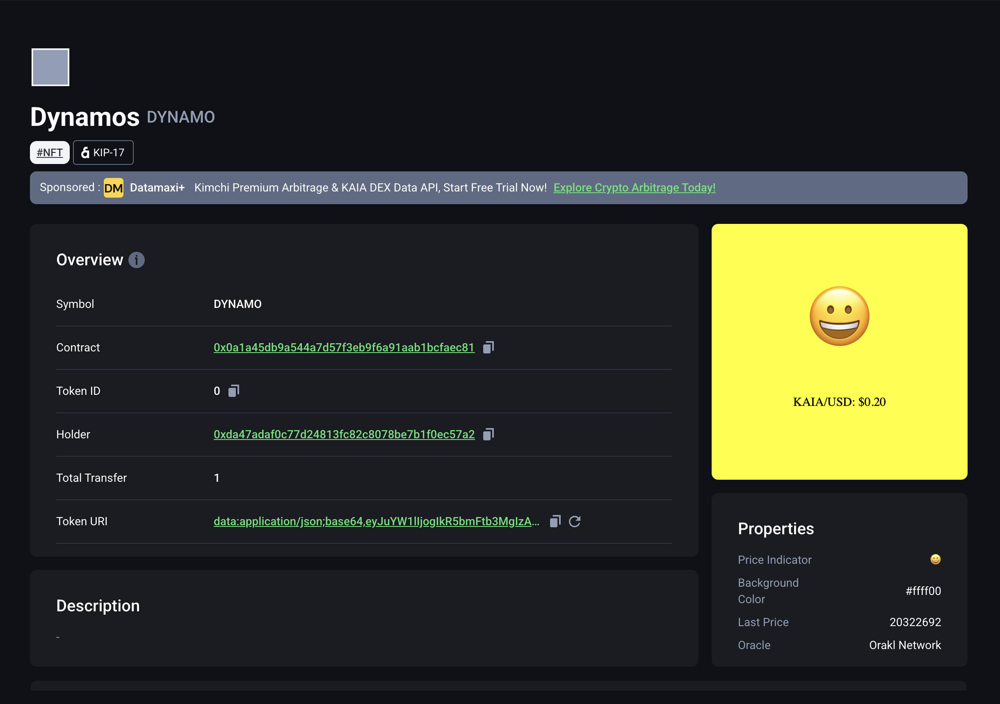
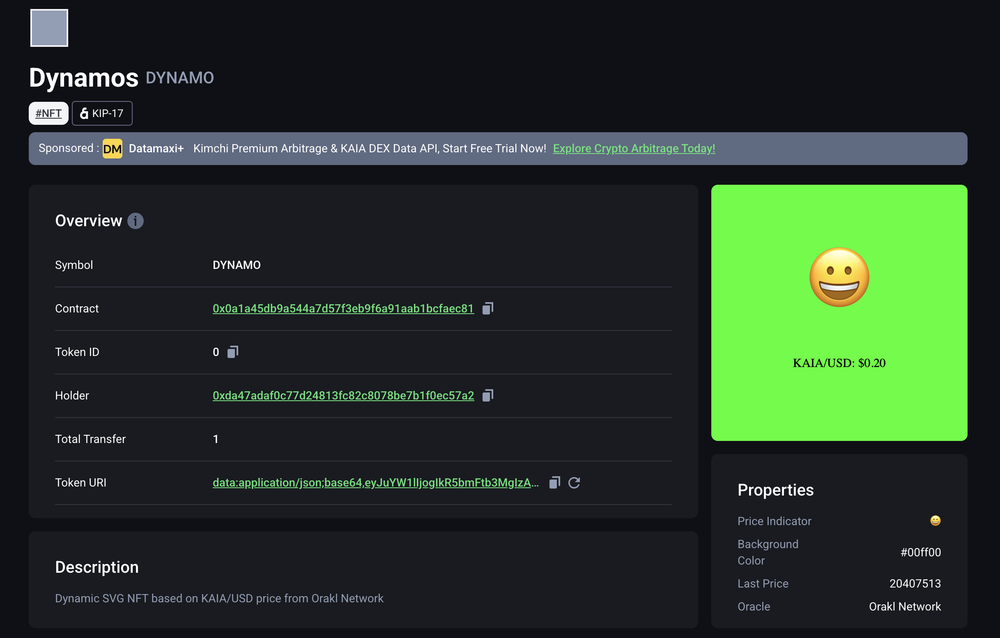

# Install Foundry

```bash
curl -L https://foundry.paradigm.xyz | bash 
```

# Initialize foundry project

```bash
forge init dynamos 

cd dynamos 
```

# Install Dependencies

```bash
forge install Bisonai/orakl@master

forge install OpenZeppelin/openzeppelin-contracts@v4.6.0 
```

## Correct import for dependencies

```solidity
// Importing OpenZeppelin contracts
import "@openzeppelin/contracts/token/ERC721/extensions/ERC721URIStorage.sol";
import "@openzeppelin/contracts/utils/Counters.sol";
import "@openzeppelin/contracts/utils/Base64.sol";

// Importing Orakl contracts
import { IFeedProxy } from "@bisonai/orakl-contracts/v0.2/src/interfaces/IFeedProxy.sol";
```
add remappings to foundry.toml file

```bash
remappings = [
    "@openzeppelin/=lib/openzeppelin-contracts/",
    "@bisonai/orakl-contracts=lib/orakl/contracts/"
]
```

# Configure .env for RPC

Create a `.env` file at the project root folder. Copy and paste the command below in your `.env`

```
KAIROS_RPC_URL=https://responsive-green-emerald.kaia-kairos.quiknode.pro/
```
Add this to your foundry.toml file:

```bash
[rpc_endpoints]
kairos = "${KAIROS_RPC_URL}"
```

# Import Account

```bash
cast wallet import --interactive test-account
```

Enter the respective values as prompted in your terminal:

```bash
input private key:
input password:
```

# Compile

```
forge build
```

# Script for Deployment

```solidity
// SPDX-License-Identifier: UNLICENSED
pragma solidity ^0.8.13;

import {Script, console} from "forge-std/Script.sol";
import {Dynamos} from "../src/Dynamos.sol";

contract DynamosScript is Script {
    Dynamos public dynamos;

    function setUp() public {}

    function run() public {
        vm.startBroadcast();

        address feedProxy = 0xC2caA26226585F666Ec79f8eCDB0AEc17893aF1d;

        dynamos = new Dynamos(feedProxy);

        vm.stopBroadcast();
    }
}
```

## Using forge script:

```bash
# To load the variables in the .env file
source .env

# To deploy our contract
forge script --chain 1001 script/Dynamos.s.sol:DynamosScript --rpc-url $KAIROS_RPC_URL --broadcast -vvvv --account test-account
```
Result: 

```bash
Tx hash. 
✅  [Success] Hash: 0xa9721348f8eede3155a2a9c7c647c6e72b4cf44737a7306b482fe5dabf08d8a1
Contract Address: 0x0a1A45Db9a544a7D57f3Eb9f6a91AAB1BcFaec81
Block: 189136808
Paid: 0.15539843 ETH (5650852 gas * 27.5 gwei)
```

NFT Minted at contract deployment: 



# Interact with Deployed Contract

Function to interact with: `getOraklDataFeedLatestAnswer`, `lastPrice`, `updateSVG`, 
 
1. getOraklDataFeedLatestAnswer()

```bash
cast call 0x0a1a45db9a544a7d57f3eb9f6a91aab1bcfaec81  "getOraklDataFeedLatestAnswer()" --rpc-url $KAIROS_RPC_URL
```

```bash 
Answer: 0x00000000000000000000000000000000000000000000000000000000013723a6
```
Convert Hex to Dec [here](https://www.rapidtables.com/convert/number/hex-to-decimal.html):  20390822


2. lastPrice()

```bash
cast call 0x0a1a45db9a544a7d57f3eb9f6a91aab1bcfaec81  "lastPrice()" --rpc-url $KAIROS_RPC_URL
```

```bash
Answer: 0x0000000000000000000000000000000000000000000000000000000001361984
```

Hex to Dec: 20322692 


3. updateSVG

```bash
cast send --rpc-url=$KAIROS_RPC_URL 0x0a1a45db9a544a7d57f3eb9f6a91aab1bcfaec81  "updateSVG(uint256)" 0 --account test-account
```

```bash
txHash: 0x39ac46c5792e8b8795f2b47ba3c34069de8a1bc6ff30caff64fbc297dd85e690 
```
Refresh token URI on explorer

New image based on price changes. 




# Verify Contract 

## Flatten Contract 

```bash
forge flatten src/Dynamos.sol > FlattenedDynamos.sol
```

## Run Verify

```bash
forge verify-contract --verifier-url https://kairos-api.kaiascan.io/forge-verify-flatten --chain-id 1001 --constructor-args $(cast abi-encode "constructor(address)" 0xC2caA26226585F666Ec79f8eCDB0AEc17893aF1d) --compiler-version v0.8.30+commit.73712a01 0x0a1a45db9a544a7d57f3eb9f6a91aab1bcfaec81 FlattenedDynamos.sol:Dynamos --retries 1
```

result 

```bash
Start verifying contract `0x0a1A45Db9a544a7D57f3Eb9f6a91AAB1BcFaec81` deployed on 1001
Compiler version: v0.8.30+commit.73712a01
Constructor args: 0x000000000000000000000000c2caa26226585f666ec79f8ecdb0aec17893af1d
Attempting to verify on Sourcify. Pass the --etherscan-api-key <API_KEY> to verify on Etherscan, or use the --verifier flag to verify on another provider.

Submitting verification for [Dynamos] "0x0a1A45Db9a544a7D57f3Eb9f6a91AAB1BcFaec81".
Contract successfully verified
```